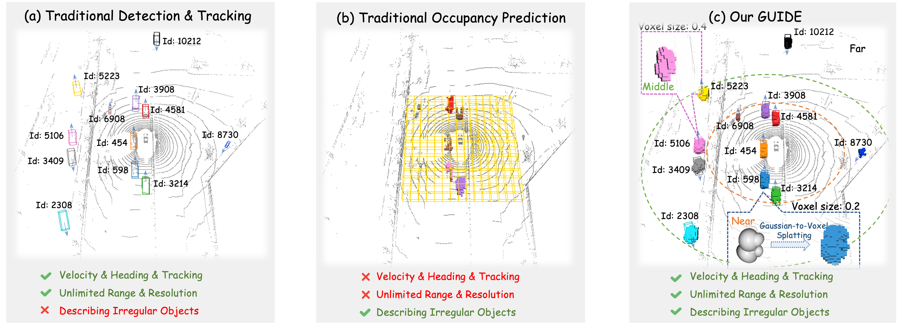
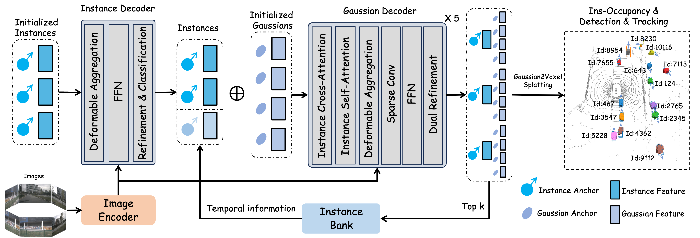

<div align="center">
  <h1>
    <a href="https://arxiv.org/pdf/2511.12941" target="_blank" rel="noopener noreferrer">
      GUIDE: Gaussian Unified Instance Detection for Enhanced Obstacle Perception in Autonomous Driving
    </a>
  </h1>
</div>

<center>
  
  <br>
  <div style="border-bottom: 1px solid #d9d9d9;
              display: inline-block;
              color: #999;
              padding: 2px;">
    Teaser Figure
  </div>
</center>


## News
* **`Apr, 2026`:** We’ve cleaned up and reorganized the code for better readability — code and models are now open-sourced!
* **`Nov, 2025`:** GUIDE is accepted by AAAI 2026 and we release the GUIDE paper on [arXiv](https://arxiv.org/pdf/2511.12941). Code & Models will be soon released.


## Introduction
> Our primary contributions are as follows:
- We propose GUIDE, a Gaussian-based unified instance detection framework that supports instance-level occupancy prediction while simultaneously performing traditional 3D object detection and tracking.
- Our method employs a fully sparse representation for instance occupancy, greatly enhancing memory efficiency and allowing for flexible adjustment of inference resolution, thanks to the properties of Gaussian representation.
- GUIDE achieves an instance occupancy detection mAP of 21.61 on the nuScenes benchmark, reflecting a 50% improvement over SparseOcc, and delivers competitive performance in both detection and tracking tasks.

<center>
    
    <br>
    <div style="color:orange; border-bottom: 1px solid #d9d9d9;
    display: inline-block;
    color: #999;
    padding: 2px;">Framework of our GUIDE. Instance queries and their anchors are subsequently initialized and iteratively updated through interactions with image features using the instance decoder. The updated top-k instances are combined with those in the historical instance bank to form a new candidate instance set. Each instance is then associated with multiple 3D Gaussians, which serve as their representations. These Gaussians are refined iteratively through a 5-layer Gaussian Decoder. Subsequently, instance occupancy predictions are generated via Gaussian-to-Voxel Splatting. And aggregating Gaussian features allows reconstruction of instance-level representations to predict each instance's bounding box and category. Additionally, the top-k instances update the instance bank, adding temporal information to aid inference for later frames. Meanwhile, we assign unique IDs to instances whose confidence scores exceed a predefined threshold in the instance bank for instance tracking across frames.</div>
</center>

## Main results
<small>Note: The reported training results may differ slightly from those in the paper due to the inherent randomness and non-determinism in the training process (e.g., random initialization, data shuffling, and hardware/parallelism effects).</small>
| Model | config | ckpt | det: mAP | det: NDS | track: AMOTA | track: IDS | occ: (mAP<sub>occ</sub>)<sup>10</sup> |
| :---: | :---: | :---: | :---: | :---: | :---:|:---:|:---: | :---: | :----: | 
| GUIDE |[cfg](projects/configs/guide.py)|[ckpt](https://github.com/CN-ADLab/GUIDE/releases/download/v1.0/guide_gs32.pth)|41.1|51.9|39.6|577| 24.6 |


## Quick Start
[Quick Start](docs/quick_start.md)

## Citation
If you find GUIDE useful in your research or applications, please consider giving us a star &#127775; and citing it by the following BibTeX entry.
```
@misc{hu2025guidegaussianunifiedinstance,
      title={GUIDE: Gaussian Unified Instance Detection for Enhanced Obstacle Perception in Autonomous Driving}, 
      author={Chunyong Hu and Qi Luo and Jianyun Xu and Song Wang and Qiang Li and Sheng Yang},
      year={2025},
      eprint={2511.12941},
      archivePrefix={arXiv},
      primaryClass={cs.RO},
      url={https://arxiv.org/abs/2511.12941}, 
}
```

## Acknowledgement
- [SparseDrive](https://github.com/swc-17/SparseDrive)
- [GaussianFormer](https://github.com/huang-yh/GaussianFormer)
- [SparseOcc](https://github.com/MCG-NJU/SparseOcc)
- [UniAD](https://github.com/OpenDriveLab/UniAD) 
- [mmdet3d](https://github.com/open-mmlab/mmdetection3d)
